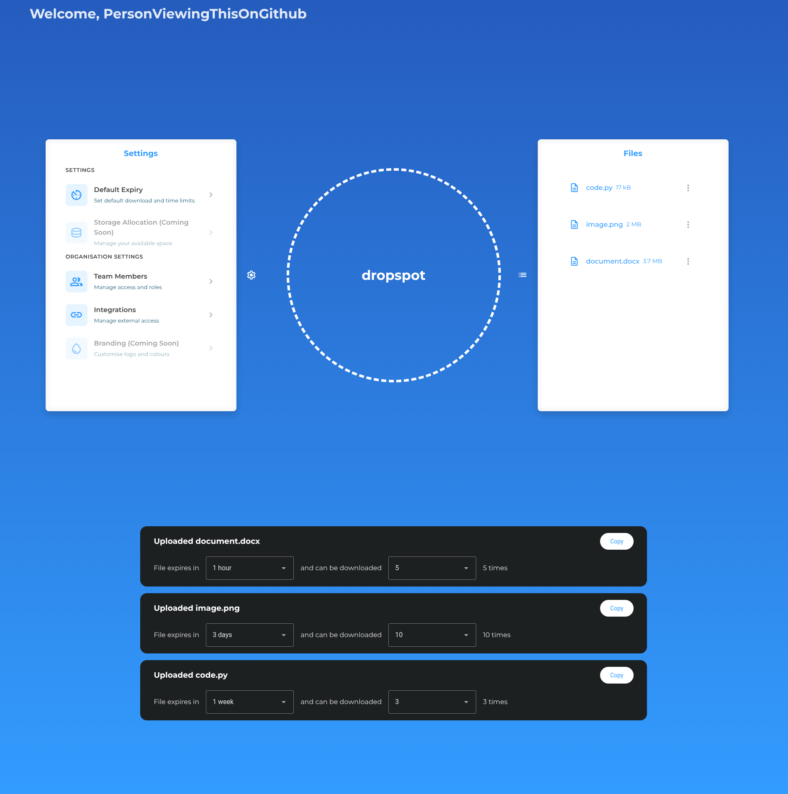

# DropSpot
A self-hostable server for timed-out and limited file uploads.
Client-side file encryption and decryption - keys never leave the browser and all data sent is encrypted.


<div align="center">
  <a href="https://app.dropspot.au">Try it out!</a>
</div>

## Contains:
* A server for running a web server which handles file uploads, downloads and user authentication
* CLI tool for interacting with the server from the command line
* Rust library to use from your own program
* JavaScript library to use from websites (the same Rust library, compiled to WebAssembly!)

## Stack
* [Axum](https://github.com/tokio-rs/axum), a Rust-powered server, with data stored by...
* [PostgreSQL](https://www.postgresql.org/), a very cool database, with interactions provided by...
* [SQLx](https://github.com/transact-rs/sqlx), the Rust SQL toolkit. All these can be communicated with using...
* [Clap](https://github.com/clap-rs/clap) command line builder for Rust! In addition to the command line, a JavaScript library for web using the same client library is provided with...
* [wasm-pack](https://github.com/wasm-bindgen/wasm-pack) turning the client library into WebAssembly for use in the browser! This can be used with...
* [LitJS](https://lit.dev/) web components for cool web interactivity, in conjunction with...
* [Material Web](https://m3.material.io/develop/web) suite of web components for a familiar UI, served by...
* [HTMX](https://four.htmx.org/)! Building interactives sites through the power of hypertext

## Integrations
* Local storage
* Google Cloud Storage
* AWS S3 (coming soon&trade;!)

## Roadmap
* User invitations
* Docker image
* Groups and permissions
* Multiple organisations per instance
* Managed DropSpot instances
* Peer-to-peer file transfers

## Setup
### Docker coming soon!
The setup assumes you have a PostgreSQL database running with a valid connection string provided in the `DROPSPOT_DATABASE_URL` environment variable.

Requirements:

### Server:
* `cargo`
* `sqlx`
* Postgres >=18.0
* The ability to write to your OS's temporary directory

Setup:
```
# Migrate the database
./scripts/migrate-database.sh

# Run the server
dropspot server run

# Delete any encrypted files from disk after they've been expired
# Note that expired will still not be able to be accessed from the application, this just frees up the physical memory
dropspot server watch
```

### CLI:
```
# Runs a local DropSpot server
dropspot server run

# Watches and deletes any files which have expired
dropspot file watch

# Create a DropSpot user (optional)
dropspot auth create

# Log into said user (if you created one)
dropspot auth login

# Upload a file
dropspot file upload <file_name>

# Download a file
dropspot file download <file_id>

# Retrieve a file's details (requires authentication)
dropspot file get <file_id>

# Retrieve all files' details (requires authentication)
dropspot file list
```

If running through `cargo`, simply replace the `dropspot` command with `cargo run --package dropspot-server`

## Crates
### Core
The `dropspot-core` crate provides all the user-facing functionality needed to interact with the server

### Server
The `dropspot-server` crate provides the server logic, database integration and CLI tooling required to run and interact with DropSpot

## Features
| Name | Description | Default |
| --------------- | --------------- | --------------- |
| `client` | Allows the `auth` and `file` commands to be run in the CLI | ✅ |
| `server` | Enables the `server` commands to be run in the CLI | ✅ |
| `web` | Enables web endpoints in the server | ✅ |


## Local development environment
```
./scripts/build-wasm.sh
./scripts/migrate-database.sh
bacon run-server
bacon build-web
```


### Building WebAssembly
Run the `./scripts/build-wasm.sh` script :)

### Building the web (assuming the WASM package has been built)
```
cd web
pnpm install
pnpm build
```

### Migrating the database (required if compiling with SQLX online)
```
./scripts/migrate-database.sh
```
